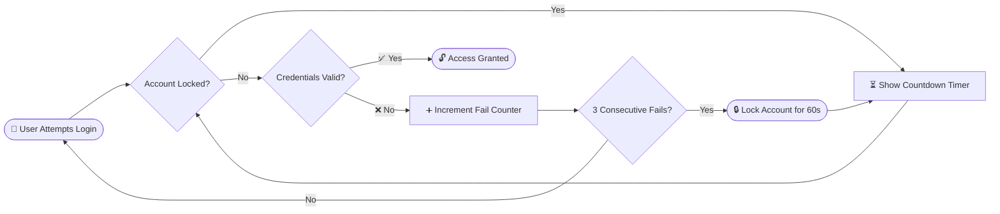
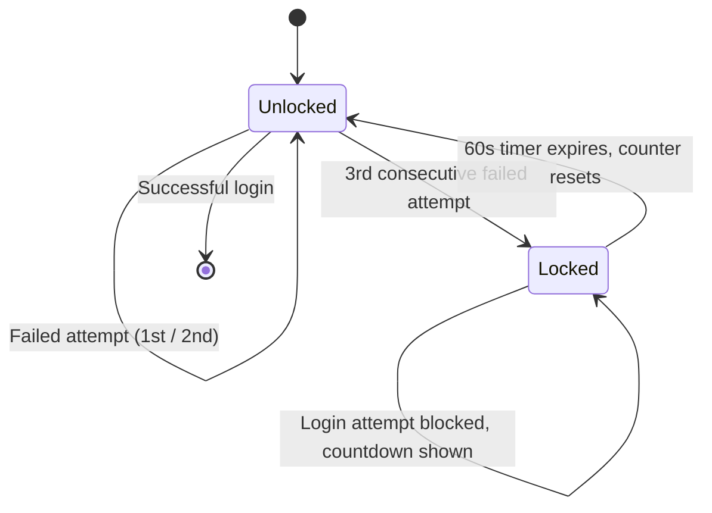
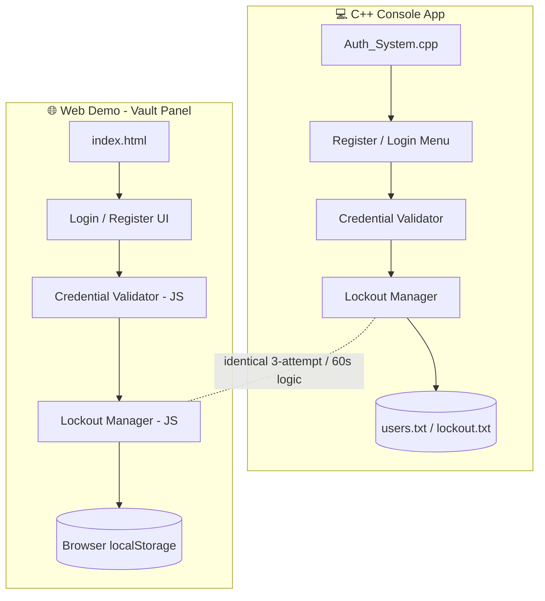

<div align="center">

<!-- Animated banner -->


<!-- Typing animation -->
<a href="https://ayeshajavid91-star.github.io/Secure-Auth-System/">
  
</a>

<br/>

<!-- Badges -->
<p>
  
  
  
  
  
</p>

<p>
  
  
  
  
  
</p>

<h3>🔐 A brute-force-resistant authentication engine — console-grade security, browser-grade convenience.</h3>

<a href="https://ayeshajavid91-star.github.io/Secure-Auth-System/">
  
</a>

</div>

<br/>


---

## 📚 Table of Contents

| # | Section |
|---|---------|
| 1 | [📌 Project Overview](#-project-overview) |
| 2 | [🎬 Preview](#-preview) |
| 3 | [✨ Features](#-features) |
| 4 | [🔒 Lockout System Deep Dive](#-lockout-system-deep-dive) |
| 5 | [🏗️ Architecture](#️-architecture) |
| 6 | [🛠️ Tech Stack](#️-tech-stack) |
| 7 | [⚙️ How It Works](#️-how-it-works) |
| 8 | [▶️ Installation & Usage](#️-installation--usage) |
| 9 | [📂 Project Structure](#-project-structure) |
| 10 | [🛡️ Security Notes](#️-security-notes) |
| 11 | [🗺️ Roadmap](#️-roadmap) |
| 12 | [👤 Author](#-author) |
| 13 | [📄 License](#-license) |

---

## 📌 Project Overview

This project implements a complete authentication flow — **user registration**, **credential verification**, and **brute-force protection** — available in two flavors:

> 💻 **C++ Console App** — credentials persisted to external files (`users.txt`, `lockout.txt`)
> 🌐 **Web Demo ("Vault Panel")** — same logic, running entirely client-side via `localStorage`

<div align="center">



</div>

---

## 🎬 Preview

<div align="center">

| 🖥️ Vault Panel — Login | 🚨 Lockout Countdown |
|:---:|:---:|
|  |  |

*(Swap these placeholders for real screenshots or a screen-recorded GIF of the Vault Panel in `/assets`)*

</div>

---

## ✨ Features

<table>
<tr>
<td width="50%" valign="top">

### 🔑 Core Features

- 📝 User registration with duplicate-username detection
- 🔐 Secure login with credential verification
- ✅ Input validation (empty fields, min password length)
- 🧂 Credentials stored with basic password encoding
- 🖥️ Clean, menu-driven console interface

</td>
<td width="50%" valign="top">

### 🔒 Account Lockout System

- 📊 Tracks failed login attempts per user
- ⛔ Auto-locks for **60 seconds** after **3 consecutive fails**
- ⏱️ Live countdown display while locked
- ♻️ Auto-unlocks & resets attempt counter after expiry
- 💾 Lockout state **persists across sessions**

</td>
</tr>
<tr>
<td colspan="2" valign="top">

### 🌐 Web Demo — "Vault Panel"

- 🖤 Secure-terminal-inspired UI for Login / Register
- 🔴 Real-time **failed-attempt LED indicator**
- ⏳ Live lockout countdown timer, client-side
- 🔁 Identical **3-attempt / 60-second** lockout logic as the C++ core — no server required

</td>
</tr>
</table>

---

## 🔒 Lockout System Deep Dive

<details>
<summary><b>🔍 Click to expand — Lockout state machine</b></summary>

<br/>



| State | Trigger | Behavior |
|:---|:---|:---|
| 🟢 Unlocked | Default / after timer expiry | Login attempts allowed, counter tracked |
| 🟡 Warning | 1–2 failed attempts | User notified of remaining attempts |
| 🔴 Locked | 3rd consecutive failure | All logins blocked, 60s countdown starts |
| 🔓 Reset | Successful login **or** timer expiry | Fail counter reset to 0 |

</details>

<details>
<summary><b>💻 Click to expand — C++ lockout logic sample</b></summary>

<br/>

```cpp
bool attemptLogin(User &user, const string &password) {
    if (isLocked(user)) {
        cout << "🔒 Account locked. Try again in "
             << remainingLockTime(user) << "s\n";
        return false;
    }

    if (verifyPassword(user, password)) {
        user.failedAttempts = 0;   // ✅ reset on success
        return true;
    }

    user.failedAttempts++;
    if (user.failedAttempts >= 3) {
        user.lockUntil = time(nullptr) + 60; // 🔒 lock for 60s
        cout << "🚨 Too many failed attempts. Account locked for 60s.\n";
    }
    return false;
}
```

</details>

---

## 🏗️ Architecture

<div align="center">



</div>

---

## 🛠️ Tech Stack

<div align="center">


</div>

<div align="center">

| Layer | Technology |
|:---|:---|
| 🎮 Core Logic | C++ — `fstream`, `structs`, `maps`, `ctime` |
| 💻 Console App | C++ |
| 🌐 Web Demo | HTML5, CSS3, Vanilla JavaScript |
| 🗄️ Storage (C++) | External files — `users.txt`, `lockout.txt` |
| 🗄️ Storage (Web) | Browser `localStorage` |
| 🚀 Hosting | GitHub Pages |

</div>

---

## ⚙️ How It Works

| Step | Description |
|:---:|:---|
| 1️⃣ | **Registration** — username & password validated, then securely stored |
| 2️⃣ | **Login** — system checks for an active lockout *before* verifying credentials |
| 3️⃣ | **Lockout Logic** — each failed attempt increments a counter; on the 3rd consecutive failure, the account locks for 60 seconds and further attempts are blocked until the timer expires |

---

## ▶️ Installation & Usage

### 💻 C++ Console Version

```bash
g++ Auth_System.cpp -o Auth_System
./Auth_System
```

Follow the on-screen menu to **Register**, **Login**, or **Exit**.

### 🌐 Web Demo

No installation needed — try it live:

<div align="center">

<a href="https://ayeshajavid91-star.github.io/Secure-Auth-System/">
  
</a>

</div>

Or run locally:

```bash
git clone https://github.com/ayeshajavid91-star/Secure-Auth-System.git
cd Secure-Auth-System
```

Then open `index.html` in your browser.

---

## 📂 Project Structure

```
Secure-Auth-System/
│
├── 💻 Auth_System.cpp     # C++ console application
├── 🌐 index.html          # Web demo (Vault Panel)
├── 🎨 style.css            # Vault Panel styling (if separated)
├── ⚙️ script.js            # Login / lockout logic (if separated)
└── 📘 README.md            # You are here
```

---

## 🛡️ Security Notes

> ⚠️ This project is built for **learning and demonstration purposes**. It is not intended as a production-grade auth system.

- 🧂 Passwords use **basic encoding**, not a cryptographic hashing algorithm like bcrypt/Argon2
- 🗄️ The C++ version stores data in **plain external files**, not an encrypted database
- 🌐 The web demo's `localStorage` is **client-side only** and not a substitute for real server-side auth
- ✅ For production use, pair this logic with salted password hashing, HTTPS, and server-side session management

---

## 🗺️ Roadmap

- [x] Registration + login with validation
- [x] 3-attempt / 60-second lockout mechanism
- [x] Web demo with live countdown & LED indicators
- [ ] Password hashing (bcrypt-style) 🔐
- [ ] Two-factor authentication (2FA) 📲
- [ ] Admin dashboard for account management 🛠️
- [ ] Configurable lockout thresholds ⚙️

---

## 🏷️ Suggested GitHub Topics

```
cpp
authentication-system
login-system
secure-login
file-handling
password-security
lockout-mechanism
javascript
html-css-javascript
web-app
console-application
programming-project
```

---

## 👤 Author

<div align="center">

**Developed by Ayesha Javid**

<a href="mailto:ayeshajavid91@gmail.com">
  
</a>
<a href="https://github.com/ayeshajavid91-star">
  
</a>

</div>

---

## 📄 License

**All Rights Reserved.**

This project and its source code are the intellectual property of the author. No part of this repository — including the code, design, or documentation — may be copied, modified, distributed, used, or reproduced in any form without the explicit written permission of the author.

© 2026 Ayesha Javid. Unauthorized use is strictly prohibited.

For permissions or licensing inquiries, contact: **ayeshajavid91@gmail.com**

---

<div align="center">


⭐ *If you like this project, consider giving it a star!* ⭐

</div>
